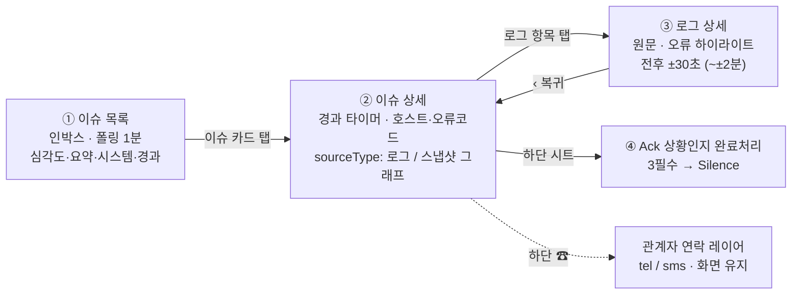
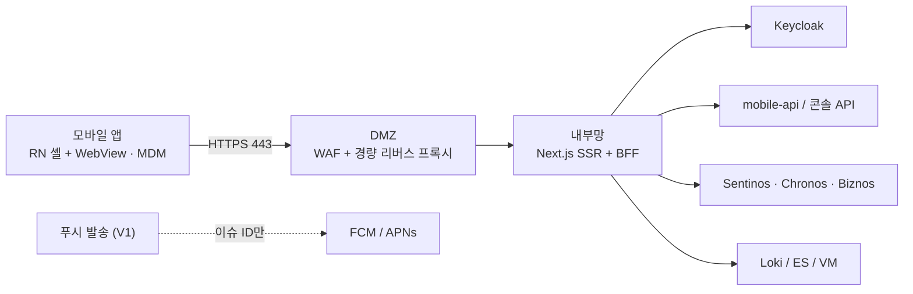

# Sentinos Mobile — 기획 문서 v2.2

> **상태**: 기획 완결 · 개발 진행 중  
> **작성 기준일**: 2026-07-13  
> **버전 이력**: v2.0(2026-07-06 기획 완결) → v2.1(2026-07-10 인박스 정책) → **v2.2(2026-07-10 콘솔 UI 정합)**  
> **본 문서 역할**: 로컬 저장소의 **일상 작업용 기획 정본**. 외부 아티팩트·GitHub 이슈·llm-wiki 결정을 한곳에 통합한다.

---

## 0. 정본·출처 맵

| 구분 | 위치 | 비고 |
|---|---|---|
| 확정 기획안 v2.0 (원 아티팩트) | [claude.ai artifact](https://claude.ai/code/artifact/aab140d5-1ebf-4699-b9a6-9f68e3a24939) | R1~R11 · GD-1~GD-5 · 목업. 외부 정본 |
| 워킹 드래프트 | [artifact](https://claude.ai/code/artifact/5ccbaaaf-3d62-44e0-a5b6-8c4989399e30) | 검토 과정·미채택안 보존 |
| MVP 설계 스펙 | [`docs/superpowers/specs/2026-07-06-sentinos-mobile-mvp-design.md`](../superpowers/specs/2026-07-06-sentinos-mobile-mvp-design.md) | 갭 G1~G7 · 로드맵 |
| 디자인 프롬프트 | [`docs/design/mobile-web-design-prompt.md`](../design/mobile-web-design-prompt.md) | 화면 구현용 토큰·화면 8종 |
| 디자인 컨셉 (본 저장소) | [`docs/design/sentinos-mobile-디자인-컨셉.md`](../design/sentinos-mobile-디자인-컨셉.md) | 의도·시각 언어·상태 규칙 |
| 저장소 요약 | [`README.md`](../../README.md) | 확정 결정 한눈에 |
| 프로젝트 허브 (wiki) | `llm-wiki/프로젝트/모니터링-모바일앱` | 진행·개정 타임라인 |
| 결정 노트 (wiki) | 컨셉 · 스택 · 화면 · 인박스 데이터소스 | 선택지·근거 |

**버전 우선순위**: 같은 조항이 충돌하면 **본 문서 v2.2 > MVP 스펙 md의 구절 > wiki 요약 > 아티팩트 v2.0** 순으로 해석한다. (v2.1·v2.2 개정은 아티팩트 이후 반영분이다.)

---

## 1. 목적·성공 기준

### 1.1 한 줄 목적

야간·이동 중 장애를 인지한 담당자가 노트북 없이  
**이슈 확인 → 발생시간·서버·호스트 특정 → 로그 원문/그래프 → Ack(Silence) 또는 관계자 연락**까지  
**3분 안에** 끝내는 것.

대시보드의 축소판이 아니다. **대응 시간 단축 도구**다.

### 1.2 성공 지표

| 지표 | 목표 | 비고 |
|---|---|---|
| MTTA (인지 후) | **1분** | MVP 기준. “발생 기준 1분”은 V1 푸시 목표로 이관 |
| 초동 플로우 완료 | **3분 내** | 인박스 → 상세 → 로그/그래프 → Ack 또는 연락 |
| 단순 확인 건 PC 부팅 필요율 | **0%** | R10 콘솔 링크 복사율 + 콘솔 접속 대조로 프록시 측정 |
| Travel Time | 제거 | 자리 이동 전 모바일 단독 초동 |

### 1.3 비목표 (MVP)

- 서버 제어·명령 원격 실행 UI
- 대시보드/시스템 헬스 전용 탭 (System Health는 인박스 헤더 배지만)
- 푸시 알림 (V1)
- 라이브 로그 테일·워룸 타임라인 완성 (V1)
- 에스컬레이션·온콜·위젯/워치 (V2)

---

## 2. 문제 정의

| 현재 문제 | 영향 |
|---|---|
| 업무 외 시간·외부망에서 관제 툴(로그 등) 접근 제한 | 담당자 출근·현장 도착 전까지 파악 지연 |
| 개인정보·보안 이슈로 자택 상세 확인 곤란 | 초동 대처의 물리적 한계 |
| PC 부팅·VPN·콘솔 진입 비용 | MTTA·MTTR 악화, 야간 피로 증가 |

**수행 주체**: ICT기획부(SRE품질). **목표 시기**: 3분기 내 완성.  
**브랜딩**: Sentinos Mobile — Sentinos · Chronos · Biznos 관제의 모바일 확장.

---

## 3. 사용자·페르소나

| 페르소나 | 상황 | 우선 가치 |
|---|---|---|
| **상황실 OP** (`warroom-op`) | 침대·한 손·새벽 호출 | 신속 초동, 오조작 방지, 연락·Ack 동선 |
| **개발/운영 담당** (`dev-operator`) | 원인 특정·로그·이력 | 원문·그래프·재사용 조치·분석 가능 기록 |

기획 수정·기능 추가 시 **3-페르소나 사이클**(기획 → warroom-op · dev-operator 평가 → 반영)을 돌린다.  
에이전트 정의: 구현 repo `.claude/agents/` 및 본 저장소 연계.

---

## 4. 제품 컨셉

### 4.1 A+C 하이브리드 (확정)

| 안 | 역할 | 채택 |
|---|---|---|
| **A** 이슈 인박스 (Alert-First) | **홈** — 활성 이슈 피드, 최단 동선 | ✅ 홈 |
| **B** 글랜스 대시보드 | 평시 헬스 | 탭 제거 → 헤더 System Health 배지로 축소 |
| **C** 워룸 (Incident-First) | **상세** — 원인 파악 깊이 | ✅ 이슈 상세 (MVP는 정적 로그/스냅샷, V1 워룸 완성) |

**이유**: 야간 인지 → 모바일 단독 초동 시나리오와 동선 일치. 각 안의 약점을 상호 상쇄.

### 4.2 콘솔과 모바일의 역할 분담

같은 데이터를 **다르게 자른다**. 경합이 아니라 분업이다.

| | sentinos-console | Sentinos Mobile |
|---|---|---|
| 목적 | 전체 데이터의 **관리** | 모바일 **초동 대응** |
| 이슈 범위 | 전체 | **현재 활성 이슈만** |
| Ack · Silence | 조회와 **변경** 대상 | 지금 처리할 일이 아니므로 **목록에서 제외** |

모바일이 Ack·Silence된 이슈를 감추는 것은 기능 누락이 아니라 설계다.  
한 손·새벽·3분 화면에서 이미 손을 쓴 건은 잡음이다. (v2.1)

### 4.3 읽기 전용 원칙

서버 제어·명령 실행 UI 금지.  
**쓰기 허용**: Ack 저장, Runbook 체크(V1 가이드)뿐.

---

## 5. 핵심 플로우

**주 동선 4단계**: 목록 → 상세 → 로그 상세 → Ack.  
**보조**: 관계자 연락(화면 이탈 없음), 이력 탭·조치 재사용, R10 콘솔 링크 복사(PC 핸드오프).

---

## 6. 화면 요구사항 R1~R11

### R1 — 진입·갱신

- MVP: **푸시 제외**. 수동 진입 + **포그라운드 폴링 1분**, 백그라운드 정지.
- 갱신 시 스크롤 유지 + “새 이슈 N건” 배너(탭 시 최상단).
- 푸시 전 인지 채널(SMS 등)·콜드 스타트 동선 명문화. 딥링크 스킴은 MVP 선확정(SMS→이슈 직행, V1 푸시 공용).
- 이슈 상세 앱바에 새 이슈 미니 배지(탭 → 인박스).

### R2 — 이슈 인박스 카드 (v2.1 · v2.2)

**필수 표시만**:

| 요소 | 규칙 |
|---|---|
| 심각도 | 색 + 텍스트 라벨 (`CRITICAL` / `MAJOR` / `MINOR`) |
| 오류 요약 | 본문 1줄 |
| 시스템/업무 | **부서명 병기** — 예: `계정계 · COR(여신관리부)` (v2.2) |
| **담당** | **대표 담당 1인 이름만** (“외 N” 미표기). 팀만 매핑이면 팀명. 원천 = 콘솔 `owners/resolve` 우선순위 최상위 (v2.2) |
| 발생·경과 | 서버 시각 오프셋 보정 경과 타이머 |

**목록 범위 (v2.1)**:

- 인박스 = **미해결(활성)만**.
- **Ack(Silence 중) 이슈는 목록 API에서 미조회**. Ack 저장 즉시 목록에서 제거. (Silence 카운트다운 뱃지·만료 로컬 선전환 규칙은 **폐지**)
- 필터 칩: **전체 · Critical · Major · Minor** 4개 고정 (“미확인” 삭제).
- **System Health 배지** = 웹 Sentinos 산정값을 그대로 표시. 모바일 자체 산정 금지. (산정 기준 정본 문서화는 미결)

### R3 — Ack = 상황인지 완료처리

- 하단 액션 바 좌측에서 바텀시트 펼침 (고정 높이·정적 콘텐츠).
- **필수 3항목**:
  1. **조치예정일시** — 현재부터 일/시/분 상대 선택, 기본 15분, 구간 자동 표시. **의미 = Grafana Silence Notifications(스누즈) 기간**. 2시간 초과 시 인라인 경고(+1회 확인).
  2. **이슈발생원인** — 퀵 칩(“원인 파악 중” = 구조화 상태값 `미상(초동)`, 칩도 필수 충족) + 텍스트. 미상 기록은 이력 재사용 풀 제외.
  3. **조치(작업)예정내역**
- 저장 = **Ack + 알림 해제(Silence)**. 확인자·시각 자동 기록. 완료 후 읽기 전용.
- **[이 조치 재사용]**: 출처 메타 자동 저장 + 조치예정일시 강제 재선택. 무수정 복제 가중치 하향.
- **동시성**: 선처리 시 409 + “이미 {이름}님이 HH:MM 처리” → 시트 닫고 최신 반영.
- 저장 후 **인박스 복귀**(가이드 화면 발은 GD-5 우선). 해당 이슈가 목록에서 사라진 것이 정상(v2.1).
- **상세 화면 한정**: Ack 직후 그 화면에 머무는 동안 히어로 타이머가 Silence 만료 카운트다운으로 전환되는 것은 유효. (인박스에는 이 상태 없음)

### R4 — 이슈 상세 상단

- 발생일시·경과, 시스템/업무(**부서명 병기**), 호스트, 오류코드, 건수.
- **담당 전체 목록** 줄(이름·담당/팀 유형) — 콘솔 `owners/resolve` 6단계 정본, R8과 동일 원천 (v2.2).
- 레이아웃: **단일 스크롤** (상단 메타 → sourceType 데이터 → 하단 고정 액션 바).

### R5 / R7 — 상세 하단 sourceType 분기

| sourceType | UI |
|---|---|
| `loki` | 로그 목록 (“로그 N건 · LOKI”) |
| `prometheus` / `victoriametrics` | **고정 스냅샷 그래프** 1장 — 발생 시점 중심 시간창(발생-50분~현재), 임계선·발생 마커·현재값. **터치 제스처 없음** |

- sourceType **복수 없음**(단일 소스). 예외 시 로그(Loki) 우선.
- 시계열 API = 스냅샷 단일 조회.

### R6 — 로그 상세

- 별도 화면. 원문 mono, 오류 라인 하이라이트, 마스킹은 `▮▮▮`(빈칸 금지), 스택트레이스 전문.
- 전후 컨텍스트 기본 ±30초, “이전 30초 더 보기” 상한 **±2분**.
- 복사 / 공유. 공유 메뉴에 **콘솔 링크 복사(R10)**.

### R8 — 관계자 연락 레이어

- 하단 액션 바 우측 “☎ 관계자”. Ack 시트와 **같은 슬롯·동시 펼침 없음**. 터치 영역 각 44px+.
- 시스템/업무코드 기반 관계자·전화번호. `tel:` / `sms:`(이슈 요약 자동 첨부). 화면 유지.
- 통화 시도 자동 스탬프 (“HH:MM {이름} 통화 시도”).
- 데이터 소스: 콘솔 **owners/resolve** (person이 전화번호 보유). 잔여 미결 = 전화번호 **노출 범위(보안)**.

### R9 — 권한 모델

응답에 `permissions { canViewLog, canAck, canContact }`.

| 권한 없음 시 | UI |
|---|---|
| 로그 | **블러 + 자물쇠 오버레이** (“권한 받으면 볼 수 있음”). 실데이터 클라이언트 미전송(서버 403) |
| Ack · 관계자 | 하단 액션 바 🔒 비활성, 탭 시 이유 토스트 |

**“가려짐” 2종 혼용 금지**:

- 무권한 = 블러 + 자물쇠  
- 데이터 마스킹(권한 있어도 정책상 가림) = 인라인 `▮▮▮`

권한 부여 체계: Keycloak realm role 방향. **부여 기준·관리 주체**는 잔여 미결.

### R10 — 콘솔 링크 복사 (PC 핸드오프)

- 이슈 ID + 로그 시간 구간 포함 sentinos-console URL.
- **공유 메뉴 내부** 배치 (액션 바 금지).

### R11 — 데이터 신선도·시간 규칙

1. 폴링 연속 실패 → 스테일 배너 (“HH:MM 이후 갱신 실패 — 표시 중인 목록은 과거입니다”) + 목록 시각적 뮤트. 인박스·상세·이력 공통.  
   **“지금은 조용합니다”와 “고장남”을 절대 같은 화면으로 만들지 않는다.**
2. 모든 시간 표시 = **서버 시각 오프셋 보정**. `Date.now()` 단독 사용 금지.
3. 딥링크 스킴 MVP 선확정.
4. 세션 만료 시 생체인증 1회 재개(SSO 풀 로그인 금지). 백그라운드 재검증·폴백은 인증 방안(#6)과 연동.

---

## 7. 탭·설정·이력

### 탭 구성

**이슈 · 이력 · 설정** 3탭. (대시보드·시스템 탭 없음)

### 이력 탭

- 검색 + 재발 Top 그룹(오류코드 단위) + 당시 원인·조치 기록.
- 상세 “이력에서 보기” → 프리필터 진입.
- **[이 조치 재사용]** → Ack 시트 프리필. “원인 미확정”은 재사용 버튼 없이 뮤트.
- 콘솔 조치 지식·pgvector 의미검색 연계 방향(상향). 데이터 범위(기간·페이지네이션·집계)는 미결(P6).

### 설정 탭 (MVP)

1. **로그인 정보** — SSO 계정, 권한 뱃지(로그/Ack/연락), 마지막 로그인, 로그아웃  
2. **테마** — 다크(기본·첫 실행 고정) | 라이트 | 시스템  
3. **앱 정보** — 버전  
4. 예약: **알림 설정** — V1 푸시 도입 시  

---

## 8. 가이드 화면 (V1) — GD 요약

MVP 범위 밖. **G-3 확정**: 상세 AI 요약 스트립 + 전용 가이드 화면 (`/issues/[id]/guide`).

| 항목 | 요지 |
|---|---|
| GD-1~GD-5 | caution 읽음 확인 후 축약, Runbook 체크리스트, AI 섹션, 가이드발 Ack, 오프라인 로컬 체크 |
| AC-G1~G16 | 수용 조건 세트 — [#19](https://github.com/BDK-CHOI/sentinos-mobile/issues/19) |
| 핵심 규칙 | 근거 없는 AI 추정 렌더 금지 · 빈 가이드 시 스트립 숨김 · Ack 첨부는 사람 체크 기록(AI 문장 라벨 분리) · Silence 재개 시 0/n 리셋+이전 수행 스탬프 · 명령어 체크 = “콘솔에서 수행함” |

상세 스펙은 확정 기획안 아티팩트 및 #19. 본 문서에서는 MVP 범위와 경계를 고정한다.

---

## 9. 아키텍처·기술

### 9.1 스택

| 계층 | 선택 | 근거 |
|---|---|---|
| 셸 | React Native + WebView | 푸시·생체·딥링크·MDM. 주요 UI는 웹 배포로 갱신 |
| 모바일 웹 | **Next.js (SSR + Route Handler BFF)** 내부망 | 토큰·마스킹·집계. DMZ에 데이터 미보관 |
| 백엔드 | Spring (`sentinos-mobile-api`) | 인박스 등 도메인 API. 콘솔 의미론 정본과 정합 |
| 인증 | Keycloak OTP 외부 연계 | 방안 A(프록시 화이트리스트) vs B(대리 로그인) — 보안팀 협의 중 |
| 보안 | 사내 MDM | 솔루션 확정 전 |

### 9.2 망 구성

원칙:

1. DMZ **데이터 미보관** (TLS·Rate Limit·경로 필터·정적 캐시)  
2. 내부 API **직접 노출 금지** (BFF)  
3. 로그 마스킹 **서버사이드**  
4. 푸시 페이로드 최소화  

### 9.3 인박스 데이터 소스 (2026-07-10 확정)

| 항목 | 결정 |
|---|---|
| 원장 | PostgreSQL **`event_history`** “발생중” 행 (`resolve_at IS NULL` 등) |
| Grafana | **보강 소스** — `sourceType`, 룰 health 등 |
| 응답 계약 | `InboxResponse` — 웹·API 동일 JSON |

**실패 의미 (운영 진실)**:

| 실패 | 응답 | 이유 |
|---|---|---|
| `event_history` | **5xx** | 원장 장애를 “조용함”으로 위장하면 안 됨 |
| Grafana ruler | **200 + health degraded** | 이슈는 보여 주되 관제 눈감김을 뱃지로 |
| 업무 마스터 실패 | **200 + system: 기타** | 이름 못 붙였다고 장애를 숨기지 않음 |

시간: `event_history.start_at`은 KST 벽시계 → epoch 변환 시 **`Asia/Seoul` 명시**.

### 9.4 스펙 갭 G1~G7

| # | 결정 |
|---|---|
| G1 | 폴링 포그라운드 1분, 백그라운드 정지 |
| G2 | 이슈 상태 모델 = 웹 Sentinos와 동일 (모바일 임의 상태 금지) |
| G3 | 조치예정 초과 별도 상태 없음 — Silence 만료 시 알림 자연 재개 |
| G4 | 그래프 = 고정 스냅샷 (M-1) |
| G5 | sourceType 단일 |
| G6 | 개발 크리티컬 패스 — 보류 |
| G7 | 마스킹 `▮▮▮` · 스택 전문. **마스킹 대상 범위**는 보안 협의 잔여 |

---

## 10. 로드맵

| 단계 | 범위 |
|---|---|
| **MVP (~6주)** | 인박스 · 상세(sourceType) · 로그 상세 · Ack 시트 · 관계자 레이어 · 이력 탭 · R9 권한 · 태블릿 스플릿 · SSO+생체 |
| **V1 (+6주)** | 푸시+딥링크 · 워룸(타임라인·라이브 테일) · 로그 검색·공유 · Runbook·RAG 가이드(G-3, GD) · 알림 설정 |
| **V2** | 에스컬레이션·온콜 · AI 유사장애 요약 · 위젯/워치 |

### 구현 현황 (참고, 2026-07-10 기준)

- `sentinos-mobile-web` — 스캐폴드 · 인박스 UI · BFF  
- `sentinos-mobile-api` — `GET /v1/api/issues` · `event_history` 원장  
- 상세(E4~) 이후 진행 · 실데이터 카드 시각 확인·v2.1 칩 정합 등 잔여  

---

## 11. 미결·외부 의존

| 항목 | 상태 | 추적 |
|---|---|---|
| MDM 솔루션 | 미확정 (인증 위험 수준 결정) | #5 |
| 인증 방안 A/B + 세션 생체 재개 | 보안팀 협의 | #6 |
| 사내 표준 프록시 | 미확인 | #5 |
| 전화번호 노출 범위 | 보안 | #2 |
| System Health 산정 기준 정본 | 웹 Sentinos 확인 후 문서화 | #3 · v2.1 |
| 이력 데이터 범위 (P6) | 기간·페이지·집계 | #3 |
| R9 권한 부여 기준 | 관리 주체 | #2 |
| G7 마스킹 대상 범위 | 보안 | G7 |
| Silence 만료 재등장 SQL | 제품 오너 재확인 필요 (코드 vs v2.1 문구) | wiki 인박스 데이터소스 |
| 가이드 GD 잔여 (명령 마스킹·근거 원문 뷰·신뢰도 컷·RAG 정책) | V1 | #19 |

---

## 12. 관련 저장소

| 경로 | 역할 |
|---|---|
| `sentinos-mobile` (본 repo) | 기획·설계 정본 |
| `sentinos-mobile-web` | Next.js 모바일 웹 |
| `sentinos-mobile-api` | Spring 모바일 API |
| `sentinos-console` | 도메인 의미론(이벤트·Ack·담당·Runbook) 정본 · 스택/팔레트 선례 |

계약(`InboxResponse` 등)은 웹 타입이 곧 계약이다. 변경 시 Spring DTO와 동시 수정.

---

## 13. 개정 이력

| 버전 | 날짜 | 요약 |
|---|---|---|
| v2.0 | 2026-07-06 | 기획 완결. R1~R11, GD, 3-페르소나 #20·#21 흡수 |
| v2.1 | 2026-07-10 | 인박스 = 활성만(Ack 목록 제외), 필터 4칩, Health=웹 산정값 |
| v2.2 | 2026-07-10 | 부서명 병기, 담당 표기(인박스 1인/상세 전체), owners/resolve 원천 |
| **v2.2 로컬 통합본** | **2026-07-13** | 본 md — 아티팩트·스펙·wiki 통합 일상 정본 |

---

## 14. 관련 문서

- [디자인 컨셉](../design/sentinos-mobile-디자인-컨셉.md)
- [디자인 프롬프트 (구현용)](../design/mobile-web-design-prompt.md)
- [MVP 설계 스펙](../superpowers/specs/2026-07-06-sentinos-mobile-mvp-design.md)
- [README](../../README.md)
